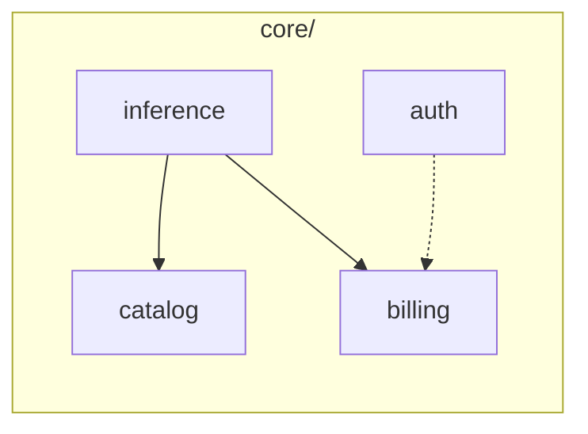

# 01 — 后端分层重构（api / core / infra）

**状态：** In Progress（Phase 0–2 已完成，Phase 3 可选）  
**日期：** 2026-05-24  
**范围：** `unillm/` 后端 Go 代码  
**不包含：** 前端 `web/` 重构、微服务拆分、数据库 schema 变更

---

## 1. 背景与目标

### 1.1 现状

当前后端约 35 个 Go 文件，名义上为 handler / service / repository 三层，但存在：

- Handler 过重（尤其 `internal/handler/proxy.go`）
- Admin、Usage 等 Handler 直连 `*gorm.DB`
- `service/auth` 依赖 `middleware` 生成 JWT（依赖倒置）
- Billing 逻辑分散在 Handler、Middleware、Service
- 部分基础设施能力已实现但未接线（Redis 限流、Fallback、密钥加密）

### 1.2 目标

采用 **DDD-lite（实用型 DDD）** 对后端进行渐进式重构：

1. 明确 **api / core / infra** 三层边界
2. 在 `core` 中按业务能力划分 **4 个模块**
3. 保持对外 API 契约不变（OpenAI 兼容接口、Dashboard、Admin）
4. 为 Billing、Proxy 关键路径补充测试护栏
5. 不改变数据库 schema，不引入事件溯源 / CQRS

### 1.3 非目标

- 不拆微服务、不拆 `go.mod` 多模块
- 不引入独立 domain 层与 PO 双模型映射
- 不重写前端
- 不在本需求内完成 Admin 独立 `core/admin`（可后续迭代）

---

## 2. 架构设计

### 2.1 分层与依赖

```
api  →  core  →  (interface)  ←  infra
```

| 层 | 职责 | 允许依赖 |
|----|------|----------|
| **api** | HTTP 路由、请求绑定、响应、中间件 | `core`、`pkg` |
| **core** | 业务规则、用例编排、Port 接口定义 | 标准库、`pkg` |
| **infra** | GORM、Redis、上游 Provider、JWT、加密 | `core`（实现其接口）、`internal/model` |

**硬性规则：**

- `core` 不得 import `gin`、`gorm`、`redis`
- `api` 不得 import `gorm`
- 依赖注入仅在 `cmd/server/main.go`（组合根）完成

### 2.2 目标目录结构

```
unillm/
├── cmd/server/main.go
├── api/
│   ├── v1/                 # OpenAI 兼容：chat、models、embeddings
│   ├── dashboard/          # JWT 用户 API
│   ├── admin/              # 管理后台 API
│   └── middleware/         # 鉴权、限流、余额、metrics
├── core/
│   ├── auth/
│   ├── catalog/
│   ├── inference/
│   └── billing/
├── infra/
│   ├── persistence/        # GORM Repository 实现
│   ├── redis/
│   ├── provider/           # 上游适配（自 internal/provider 迁入）
│   ├── jwt/
│   └── crypto/
├── internal/model/           # 暂保留 GORM 实体（后续可 rename 为 entity）
├── pkg/openai/               # 协议 DTO，保持无业务逻辑
└── migrations/
```

### 2.3 core 四个模块



| 模块 | 职责 | 主要来源 |
|------|------|----------|
| **auth** | 注册/登录、JWT、API Key CRUD 与校验 | `internal/service/auth.go`、`internal/middleware/auth.go` |
| **catalog** | Provider、ModelConfig、ProviderKey 查询与密钥池 | `internal/repository/provider.go`、Proxy/Admin 中模型解析逻辑 |
| **inference** | Chat/Embedding 编排、流式/非流式、成本估算、记用量 | `internal/handler/proxy.go`、`internal/handler/embedding.go` |
| **billing** | 余额校验、Redis 异步记账、PG flush、用量查询 | `internal/service/billing.go`、`internal/middleware/balance.go` |

Admin HTTP 初期保留在 `api/admin`，内部调用 `core` 各模块 Service，不直连 DB。

### 2.4 与 DDD 概念的对应

| DDD 概念 | 本方案 |
|----------|--------|
| 限界上下文 | `core` 四个模块（弱边界，同进程） |
| 应用服务 | `core/*/service.go` |
| 端口（Port） | `core/*/ports.go` 中的 interface |
| 适配器（Adapter） | `infra/*` |
| 聚合根 / 充血模型 | **暂不引入**，继续使用 GORM struct |

---

## 3. 模块接口（草案）

### 3.1 core/billing

```go
// ports.go
type UsageRecorder interface {
    CheckBalance(ctx context.Context, userID int64, estimate float64) (bool, error)
    Record(ctx context.Context, req UsageRequest) error
    FlushAll(ctx context.Context) error
}

type UsageQuerier interface {
    DailyUsage(ctx context.Context, userID int64, days int) ([]DailyUsage, error)
    RecentLogs(ctx context.Context, userID int64, limit int) ([]UsageLog, error)
}
```

### 3.2 core/catalog

```go
type CatalogReader interface {
    ResolveModel(ctx context.Context, publicName string) (*ModelRoute, error)
    ListPublicModels(ctx context.Context) ([]ModelInfo, error)
}

type ProviderKeyPool interface {
    NextKey(ctx context.Context, providerName string) (string, error)
    Reload(ctx context.Context) error
}
```

### 3.3 core/inference

```go
type Service interface {
    ChatCompletion(ctx context.Context, req ChatRequest) (*ChatResponse, error)
    ChatCompletionStream(ctx context.Context, req ChatRequest, w StreamWriter) error
    Embedding(ctx context.Context, req EmbeddingRequest) (*EmbeddingResponse, error)
}
```

### 3.4 core/auth

```go
type Service interface {
    Register(ctx context.Context, email, password string) (*User, error)
    Login(ctx context.Context, email, password string) (token string, err error)
    CreateAPIKey(ctx context.Context, userID int64, name string) (*APIKey, string, error)
    ValidateAPIKey(ctx context.Context, rawKey string) (*APIKeyContext, error)
}
```

---

## 4. 现有代码迁移映射

| 现有路径 | 目标路径 | 备注 |
|----------|----------|------|
| `internal/handler/proxy.go` | `api/v1/proxy.go` + `core/inference/` | 业务逻辑下沉 core |
| `internal/handler/embedding.go` | `api/v1/embedding.go` + `core/inference/` | 与 Chat 统一编排 |
| `internal/handler/auth.go` | `api/dashboard/auth.go` + `core/auth/` | |
| `internal/handler/models.go` | `api/v1/models.go` + `core/catalog/` | |
| `internal/handler/usage.go` | `api/dashboard/usage.go` + `core/billing/` | 去掉 `*gorm.DB` |
| `internal/handler/admin.go` | `api/admin/` | 改调 core，不直连 DB |
| `internal/handler/status.go` | `api/v1/status.go` 或 `api/observability/` | |
| `internal/service/auth.go` | `core/auth/service.go` | |
| `internal/service/billing.go` | `core/billing/service.go` + `infra/redis/billing.go` | |
| `internal/repository/*` | `infra/persistence/*` | 实现 core 定义的 Repo 接口 |
| `internal/provider/*` | `infra/provider/*` | |
| `internal/middleware/*` | `api/middleware/*` | JWT 生成迁到 `infra/jwt` |
| `internal/crypto/*` | `infra/crypto/*` | 接入 Provider Key 存储 |
| `internal/model/models.go` | `internal/model/models.go` | 暂不动 |
| `pkg/openai/*` | `pkg/openai/*` | 不动 |

---

## 5. 实施计划

### Phase 0 — 测试护栏（3–5 天）

**目标：** 重构前锁定关键行为。

- [x] 余额校验：`CheckBalance` 集成测试（PG balance − Redis balance_used）
- [x] 流式计费：stream token 估算与 `RecordUsage` 调用（helpers 单元测试）
- [ ] Billing flush：Redis queue → PostgreSQL `usage_logs`（待集成测试环境）
- [ ] 使用 testcontainers 或 docker-compose 依赖（postgres + redis）

**验收：** `go test ./...` 通过，新增测试可在 CI 运行。

### Phase 1 — 抽 core（约 1 周）

**目标：** 业务逻辑从 Handler 迁出，API 契约不变。

1. [x] 创建 `core/billing`，定义 Port，迁移 `billing.go` 逻辑
2. [x] 创建 `core/catalog`，迁移模型解析与 ProviderKey 池（自 proxy 抽出）
3. [x] 创建 `core/inference`，迁移 chat/embed 编排
4. [x] `proxy.go` 瘦身为 HTTP 绑定层
5. [x] `middleware/balance` 继续通过 `CheckBalance` 接口（main 注入 `core/billing.Service`）

**验收：**

- 现有 API 手动回归通过（chat 流式/非流式、embeddings、usage）
- `proxy.go` 不再含成本计算、上游调用、记账逻辑

### Phase 2 — 搬目录与清泄漏（3–5 天）

**目标：** 物理目录与逻辑边界一致。

1. [x] `internal/handler/*` → `api/*`
2. [x] `internal/repository/*` → `infra/persistence/*`
3. [x] `internal/provider/*` → `infra/provider/*`
4. [x] Admin/Usage 移除 `*gorm.DB` 直接访问
5. [x] JWT 从 middleware 迁至 `infra/jwt`，断开 `service/auth` → `middleware` 依赖
6. [x] 接线 Redis 限流（替换内存 SimpleRateLimiter）
7. [x] 接线 FallbackProvider（`FALLBACK_CHAIN` 环境变量配置）
8. [x] 接线 Provider Key AES 加密（`infra/crypto` + Admin 写入）

**验收：**

- `go test ./...` 通过
- `grep` 确认 `api/` 无 `gorm` import
- `grep` 确认 `core/` 无 `gin`/`gorm`/`redis` import
- 多实例部署时限流行为一致（Redis）

### Phase 3 — 收尾（可选，2–3 天）

- [ ] 删除空的 `internal/handler`、`internal/service`、`internal/repository` 旧包
- [ ] 更新 `HANDOFF.md` 入口说明
- [ ] 评估是否新增 `core/admin`（Admin 逻辑继续膨胀时）

---

## 6. 组合根目标形态

```go
// cmd/server/main.go — 仅 wiring，不含业务
repos := infra.NewRepos(db)
billing := corebilling.New(infrabilling.NewStore(rdb, db))
catalog := corecatalog.New(repos.Provider, infracrypto.New(cfg.EncryptionKey))
registry := infraprovider.NewRegistry(/* ... */)
inference := coreinference.New(catalog, billing, registry)
auth := coreauth.New(repos.User, repos.APIKey, infrajwt.New(cfg.JWTSecret))

router := api.NewRouter(api.Deps{
    V1:        apiv1.New(inference, catalog),
    Dashboard: apidashboard.New(auth, billing),
    Admin:     apiadmin.New(catalog, auth, billing, repos),
    Middleware: apimw.New(auth, billing, rdb, cfg),
})
```

---

## 7. 风险与缓解

| 风险 | 缓解 |
|------|------|
| 重构引入计费 bug | Phase 0 先写集成测试；Phase 1 小步 PR |
| 流式响应行为变化 | 保留现有 proxy 集成测试对比响应头与 SSE 格式 |
| 迁移期间 import 混乱 | 每 PR 只迁一个模块，旧包保留 alias 或 re-export 过渡 |
| Fallback/加密接线影响生产 | 配置项控制开关，默认与现网行为兼容 |

---

## 8. 完成定义（Definition of Done）

- [ ] 目录结构符合第 2.2 节（`internal/service` 待 Phase 3 清理）
- [x] `core` 含 auth、catalog、inference、billing 四个模块
- [x] 依赖规则通过静态检查（见 Phase 2 验收）
- [x] Billing + Inference 有关键路径单元测试
- [x] 对外 HTTP API 无 breaking change
- [x] `HANDOFF.md` 已更新重点入口路径

---

## 9. 预估工作量

| 阶段 | 人天（1 名熟悉 Go 开发者） |
|------|---------------------------|
| Phase 0 | 3–5 |
| Phase 1 | 5–7 |
| Phase 2 | 3–5 |
| Phase 3（可选） | 2–3 |
| **合计** | **约 1.5–2 周**（不含 Phase 3 则约 1.5 周） |

---

## 10. 后续演进（本需求外）

出现以下信号时，可升级为完整 DDD（独立 domain 层、Wallet 聚合等）：

- Billing 出现重复记账或余额竞态
- 团队并行开发冲突频繁
- 需要拆独立 Billing 服务

---

## 附录 A — PR 切分建议

| PR | 内容 | 可独立合并 |
|----|------|------------|
| PR-1 | Phase 0 集成测试 | ✅ |
| PR-2 | `core/billing` + middleware 改依赖 | ✅ |
| PR-3 | `core/catalog` + ProviderKey 池 | ✅ |
| PR-4 | `core/inference` + 瘦 proxy handler | ✅ |
| PR-5 | 目录搬迁 api / infra | ⚠️ 较大，可拆子 PR |
| PR-6 | Admin 去 gorm + JWT 迁移 | ✅ |
| PR-7 | Redis 限流 + Fallback + 加密接线 | ✅ |
